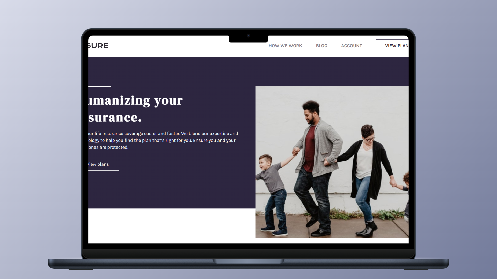

<h1 align="center">Insure Landing Page 🛡️</h1>

<p align="left">
  <a href="README_ES.md" target="_blank">
    Ver README en Español
  </a>
</p>

<p>This repository contains my personal interpretation of the "Insure Landing Page" challenge from Frontend Mentor. The main goal of this project was to enhance my HTML and CSS skills using Flexbox and the BEM (Block Element Modifier) methodology. Although the original design included multiple wave elements, I decided to omit some to achieve a cleaner and more minimalistic look.</p>
<hr>

<h1 align="center">Technologies Used</h1>
<div align="center">
  
  
</div>
<hr>

<h1 align="center">Objective</h1>
<ul>
  <li>Apply <b>Flexbox</b> for responsive and structured layouts.</li>
  <li>Use the <b>BEM methodology</b> for clean and maintainable CSS.</li>
  <li>Make design decisions to improve user experience, such as simplifying the original layout.</li>
</ul>
<hr>

<h1 align="center">Main Features</h1>
<ul>
  <li><b>Responsive Design:</b> Built using Flexbox to adapt seamlessly to various screen sizes.</li>
  <li><b>Flexbox Layout:</b> Practiced layout alignment and spacing using Flexbox.</li>
  <li><b>BEM Structure:</b> Implemented BEM methodology for scalable and readable class naming.</li>
  <li><b>Minimalist Design:</b> Chose to exclude some original wave elements for a cleaner aesthetic.</li>
</ul>
<hr>

<h1 align="center">Skills Acquired</h1>
<ul>
  <li>Strengthened core HTML and CSS foundations.</li>
  <li>Enhanced Flexbox usage for building modern layouts.</li>
  <li>Practical experience using BEM for CSS architecture.</li>
  <li>Refined design decision-making for better UI presentation.</li>
</ul>
<hr>

<h1 align="center">How to Use</h1>

1. Clone this repository to your local machine:
   ```sh
   git clone https://github.com/jordanmedinaortiz/insure-landing-page.git
   cd insure-landing-page
2. Open the project:
<ul>
  <li>Open the <code>index.html</code> file in your browser of choice.</li>
  <li>Review the implementation of HTML, CSS, Flexbox, and BEM throughout the page.</li>
</ul>
<p>You can view a live demo of the project <a href="https://jordanmedinaortiz.github.io/insure-landing-page/">here</a>.</p>

